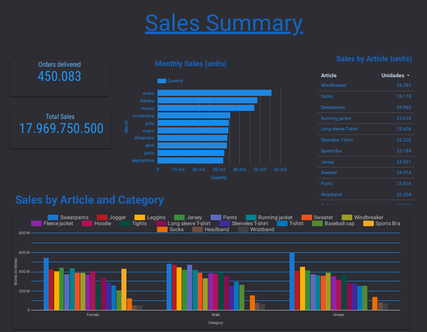

<!-- PROJECT LOGO -->
 

  

<h1 align="center">Apparel Company Dashboard</h1>

  

    This is an interactive Dashboard created using Excel and Data Studio analyzing the sales of an apparel Company.
     
    <a href="https://github.com/Daltonag1/Tech_Survey_Dashboard"><strong>Explore the docs »</strong></a>

  

<!-- ABOUT THE PROJECT -->
## About The Project
 

 

In this Project, you will find a simple dashboard analyzing bike sales consulting 1000 people. To understand if they did o didn't buy a bike, information such as income, occupation, age, commute to work, etc. was gathered.

This project was one of the assignments I had to create for a Data Science course I did a year back.

(<a href="#readme-top">back to top</a>)

## Built With

(<a href="#readme-top">back to top</a>)

<!-- GETTING STARTED -->
## Data Transformation / Cleaning
#### All data transformation and cleaning was made within the Excel file as follows:

- There was no data cleaning to be made, since the assigments was mainly focused evaluating Excel formula's knowledge.

- "Integrated Sheets" sheet was created, were all information from the rest of the sheets was integrated using VLOOKUPS and HLOOKUPS. With this final sheet, the dashboard was ready to be created.

(<a href="#readme-top">back to top</a>)

## Dashboard Creation

#### Since this dashboard was created in Looker Studio, PDF's were loaded, prevnting the interactive features. Here's a link to the dashboard

https://lookerstudio.google.com/reporting/b5ef848e-c47c-4efa-9247-ae3f17ce22ac/page/G9EsC

#### The following metrics are the ones being analyzed. Needless to say, there's much more metrics that we can analyze, but we can have a pretty good overview of what the survey has to offer:

- Total Sales and Orders Delivered.

- Monthly sales.

- Sales by Article and by category.

- Top 5 Customers and Countries.

- Top 5 Countries + Customers.

- Top 5 Customers by Country.

(<a href="#readme-top">back to top</a>)

## Conclusions Made From Metrics
#### Looking at the Dashboard, here's some of the conclusions we can get:

- There isn't an article that is sold much more than the rest. All articles are sold almost equally. There's a slight revenue increase in Sweatpants. This may indicate that the company sells in bulk to the different clients, offering the same amount of articles for each category.

- The first 3 months of the year have much higher sales than the rest of the year. I believe that clients make a big buy for the entire season on the first months and just re-stock thoughout the rest of the year.

(<a href="#readme-top">back to top</a>)

<!-- CONTRIBUTING -->
## Contributing

Contributions are what make the open source community such an amazing place to learn, inspire, and create. Any contributions you make are **greatly appreciated**.

If you have a suggestion that would make this better, please fork the repo and create a pull request. You can also simply open an issue with the tag "enhancement".
Don't forget to give the project a star! Thanks again!

1. Fork the Project
2. Create your Feature Branch (`git checkout -b feature/AmazingFeature`)
3. Commit your Changes (`git commit -m 'Add some AmazingFeature'`)
4. Push to the Branch (`git push origin feature/AmazingFeature`)
5. Open a Pull Request

(<a href="#readme-top">back to top</a>)

<!-- CONTACT -->
## Contact

Agustin Dalton - agustindalton@gmail.com

Project Link: [https://github.com/Daltonag1/Tech_Survey_Dashboard](https://github.com/Daltonag1/Tech_Survey_Dashboard)

(<a href="#readme-top">back to top</a>)

